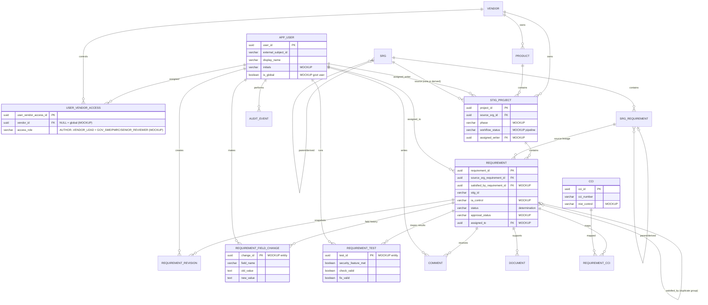

# STIG Portal — Updated ER Diagram (Central PostgreSQL)

Reflects the reconciled model in `docs/schema.sql`. New edges/entities surfaced by the
mock-up are annotated. Paste into any Mermaid renderer.

